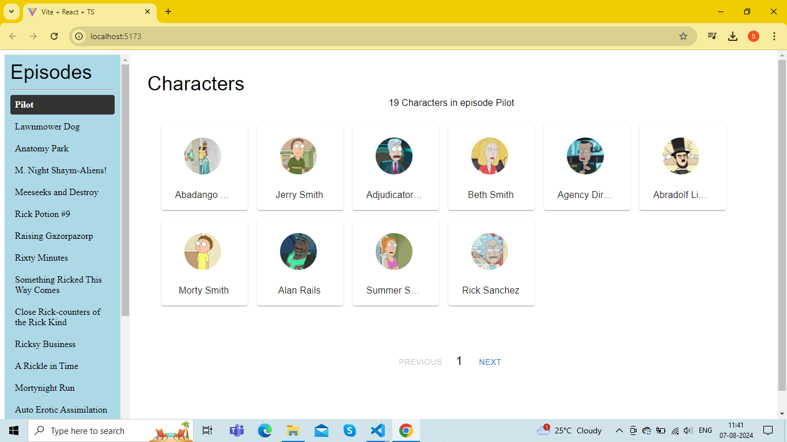

Rick and Morty Episodes and Characters Viewer Project

Features:
List of all Episodes: View all episodes of Rick and Morty
Character Details: View character for each episode
Pagination: Navigate through characters in a paginated view.

1) Install dependencies: npm install

2) Start the development server: npm start

3) Open in browser: http://localhost:3000 to view in it your browser

Technologies used:
1) React: Front-end library for building user interfaces.
2) Typescript: For type checkingand robust code
3) Material UI: UI component library for React
4) Axios: HTTP client for making API request
# React-Task

